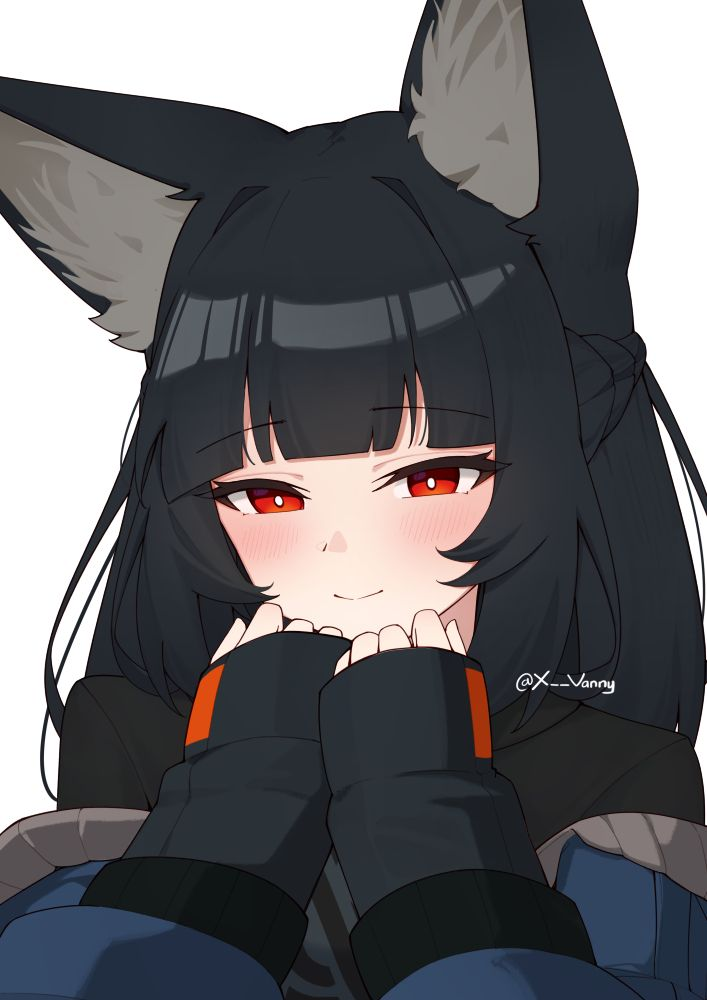
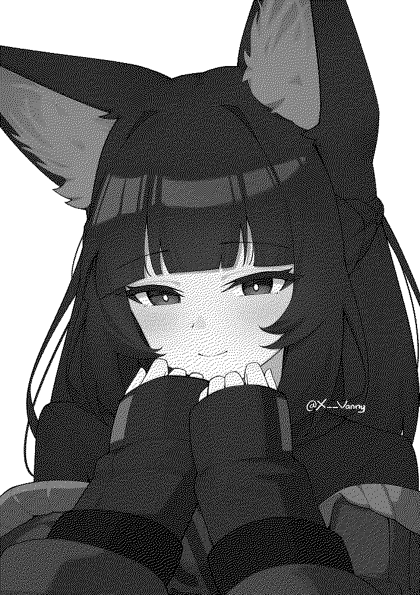
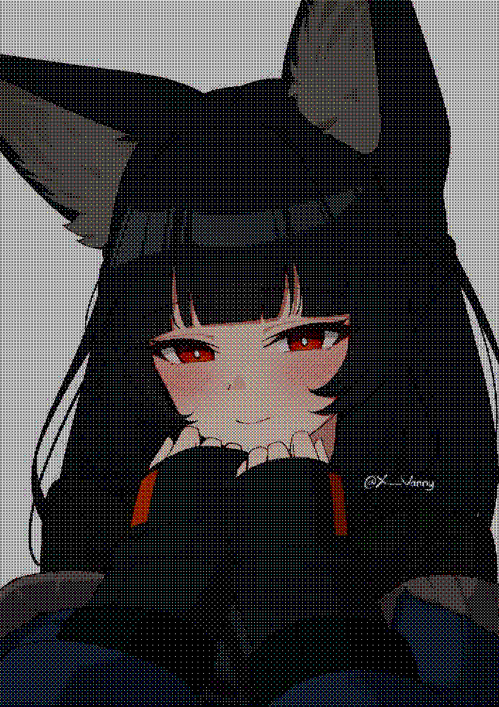

# Images-to-dots-algorithm
An algorithm that converts any image from discord (via discord media link) and recreates the images in dots! also known as Dithering.

the script uses lightweight python libraries to convert images

this version of the script converts them in black and white dots as well as colored ones.

# Examples ↓

credits to @X__vanny for the miyabi image.

"probably Ai but for example it's ok i guess"

before processing image:

after processing image (black and white "bw"):

after processing image (color "c"):

